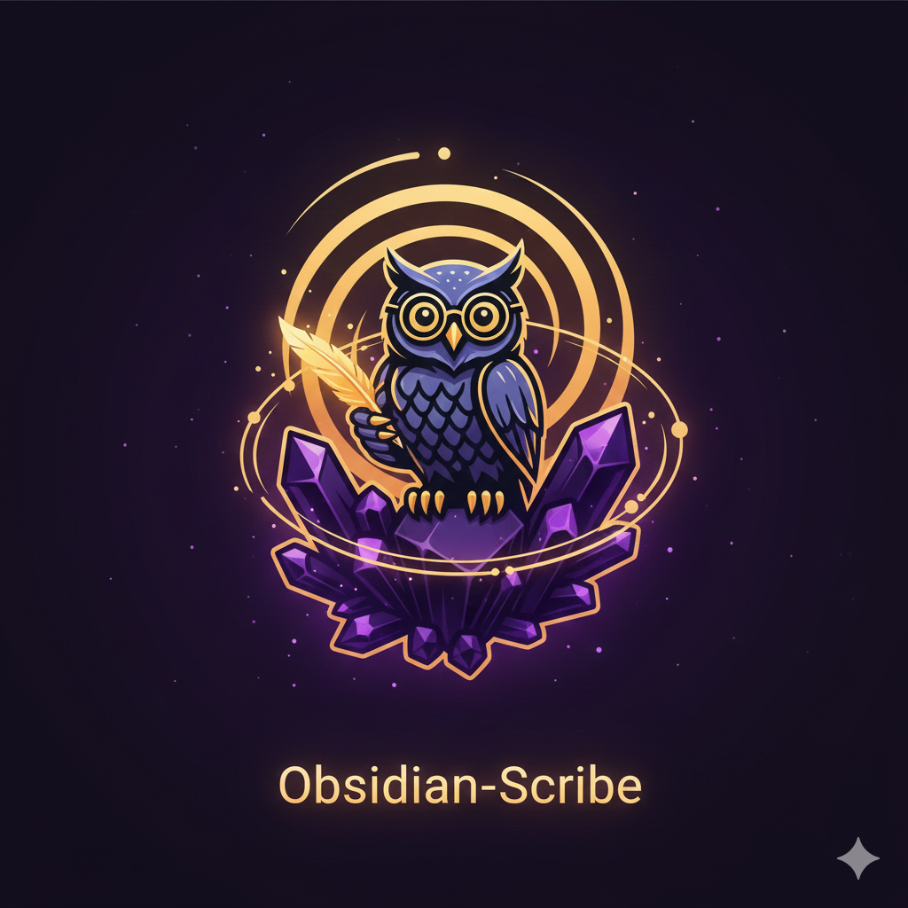

<div align="center">



# Obsidian Scribe

**Your [Obsidian](https://obsidian.md) vault as a queryable knowledge graph.**

[smoking-mirror](https://github.com/bencassie/smoking-mirror) MCP + 33 skills + 5 hooks + 8 agents = Graph-first PKM

[](LICENSE)
[](https://github.com/anthropics/claude-code)
[](https://github.com/bencassie/smoking-mirror)

</div>

---

## What Is This?

**obsidian-scribe** is a [Claude Code plugin](https://github.com/anthropics/claude-code) that turns your Obsidian vault into an AI-powered knowledge graph.

```
┌─────────────────────────────────────────────────────────────┐
│  Claude Code CLI                                            │
│  ├── obsidian-scribe plugin (skills, hooks, agents)        │
│  │   └── smoking-mirror MCP (graph queries, 47 tools)      │
│  │       └── Your Obsidian vault (notes, links, tags)      │
│  └── Read/Edit/Write tools (surgical file access)          │
└─────────────────────────────────────────────────────────────┘
```

**The stack:**
- **[smoking-mirror](https://github.com/bencassie/smoking-mirror)**: MCP server that indexes your vault and exposes 47 graph query tools (backlinks, hubs, orphans, paths, sections, frontmatter, tasks)
- **obsidian-scribe**: Claude Code plugin with 33 skills (vault analysis, daily logging, rollups), 5 hooks (achievement detection, wikilink suggestions), and 8 agents (periodic summaries, schema enforcement)
- **Claude Code**: Anthropic's CLI that orchestrates everything via natural language

**Install:**
```
/plugin marketplace add bencassie/obsidian-scribe
/plugin install obsidian-scribe@bencassie/obsidian-scribe
```

---

## Who is this for?

| If you use... | You'll love this because... |
|---------------|----------------------------|
| **[Obsidian](https://obsidian.md)** | Finally query your vault's graph structure from the command line |
| **[Claude Code](https://github.com/anthropics/claude-code)** | Purpose-built plugin with 33 skills + 5 hooks + 8 agents for knowledge management |
| **RAG systems** | Graph-first beats chunk-based retrieval for PKM (see below) |
| **[MCP](https://modelcontextprotocol.io/)** | [smoking-mirror](https://github.com/bencassie/smoking-mirror) is a production MCP server for Obsidian |

---


## Why Not RAG?

[RAG](https://en.wikipedia.org/wiki/Retrieval-augmented_generation) (Retrieval-Augmented Generation) is the standard approach for AI + knowledge bases. But for [PKM](https://en.wikipedia.org/wiki/Personal_knowledge_management), it has fundamental limitations:

| RAG Approach | Graph-First Approach |
|--------------|---------------------|
| Embed chunks → retrieve similar | Query relationships → understand structure |
| "Here are 10 similar paragraphs" | "Here's how these 3 notes connect to 12 others" |
| Static retrieval | Interactive REPL loop |
| Read-only | Read, write, and automate |
| No understanding of links | Full backlink/forward link awareness |
| Chunks lose context | Graph preserves relationships |

**The [Claude Code](https://github.com/anthropics/claude-code) REPL loop changes everything.** It's not retrieval—it's a conversation with your knowledge graph. Ask a question, get an answer, ask a follow-up, take action, all in one session.

---

## The Problem with File-Centric AI

Traditional AI tools (including RAG) read your vault file-by-file:
- 50 files × 1000 tokens = 50K tokens consumed
- Shallow understanding—no relationships
- Can't see the graph structure
- Can't take action on what it finds

**Obsidian Scribe + [smoking-mirror](https://github.com/bencassie/smoking-mirror) is different.** It treats your vault as a **queryable knowledge graph**.

---

## The Solution: Graph-First Navigation

Obsidian Scribe + [smoking-mirror MCP](https://github.com/bencassie/smoking-mirror) treats your vault as a **knowledge graph**, not a file system.

```
OLD WAY (file-centric):
  User: "Find notes about Project Alpha"
  Claude: Grep → 47 matches → Read all files → 50K+ tokens
          Manual synthesis, no relationships

NEW WAY (graph-first):
  User: "Find notes about Project Alpha"
  Claude: search_notes(title_contains="Project Alpha") → 3 core notes
          get_backlinks() → 12 notes that reference it
          get_unlinked_mentions() → 8 linking opportunities
          Surgically read 3 notes → 5K tokens
          Deep understanding with connections
```

> **[smoking-mirror](https://github.com/bencassie/smoking-mirror) gives Claude the map, not the territory.**

---

## The Three-Layer Architecture

```
YOUR EYES (smoking-mirror MCP)
  - Navigate: Where are things?
  - Discover: What exists?
  - Understand: How do things relate?
  ↓
YOUR BRAIN (obsidian-scribe skills)
  - Execute workflows
  - Maintain vault health
  - Automate patterns
  ↓
YOUR HANDS (Read/Edit/Write)
  - Read content
  - Edit text
  - Write files
```

**Use your eyes to see where to go. Only use your hands when you know what to touch.**

---

## Privacy by Design

[smoking-mirror](https://github.com/bencassie/smoking-mirror) was built with a core principle: **your content never leaves your machine**.

```
    YOUR MACHINE                           │    CLOUD
    ────────────────────────────────────── │ ────────────────
                                           │
    ┌─────────────────┐                    │
    │   Obsidian      │                    │
    │     Vault       │  NEVER LEAVES      │
    │  ┌───────────┐  │  ───────────►      │   ❌ Blocked
    │  │ Notes     │  │                    │
    │  │ Journals  │  │                    │
    │  │ Private   │  │                    │
    │  └───────────┘  │                    │
    └────────┬────────┘                    │
             │                             │
             │ Parse locally               │
             ▼                             │
    ┌─────────────────┐                    │
    │  smoking-mirror │                    │
    │     (index)     │                    │
    └────────┬────────┘                    │
             │                             │
             │ Metadata only               │
             ▼                             │
    ┌─────────────────┐    API calls      ┌─────────────────┐
    │   Claude Code   │ ───────────────►  │    Claude AI    │
    └─────────────────┘  (paths, links,   └─────────────────┘
                          tags only)
```

**What Claude receives**: File paths, link relationships, tags, frontmatter keys, word counts, dates.

**What Claude NEVER receives**: Your actual note content—unless you explicitly `Read` it.

> Your vault's secrets stay yours. Claude sees only what it needs.

---

## Token Economy

Every character Claude reads costs tokens. [smoking-mirror](https://github.com/bencassie/smoking-mirror) changes the math:

| Approach | Query | Tokens | Cost |
|----------|-------|--------|------|
| **Traditional** | "Read all notes with #project tag" | ~100,000 | ~$0.30 |
| **smoking-mirror** | `search_notes({ has_tag: "project" })` | ~500 | ~$0.0015 |

**200x savings per query.** Then Claude surgically reads only the 2-3 notes it actually needs.

---

## Performance

| Vault Size | Index Build | Query Time | Memory |
|------------|-------------|------------|--------|
| 100 notes | <200ms | <10ms | ~20MB |
| 500 notes | <500ms | <10ms | ~30MB |
| 1,500 notes | <2s | <10ms | ~50MB |
| 5,000 notes | <5s | <10ms | ~100MB |

Queries hit an in-memory index, not your filesystem. Instant results.

---

## What You Get

| Layer | Component | What It Provides |
|-------|-----------|------------------|
| **Intelligence** | [smoking-mirror](https://github.com/bencassie/smoking-mirror) MCP | 47 graph tools: backlinks, hubs, orphans, link paths, sections, frontmatter, tasks |
| **Workflows** | 35 obsidian-scribe skills | Daily logging, vault health, rollups, wikilink automation, graph analysis |
| **Automation** | 4 smart hooks | Achievement detection, wikilink suggestions, syntax validation |
| **Agents** | 8 intelligent agents | Rollup summaries, schema enforcement, relationship exploration, achievements |

---

## How It Works

Just talk naturally. No slash commands needed.

```
You: How's my vault looking?

Claude: 🔍 Vault Health Report
        Notes: 2,847
        Links: 8,234 (2.89 avg/note)
        Orphans: 43 (1.5%)
        Hubs: 12 highly-connected notes

        ⚠️ Knowledge gaps detected:
        - "API authentication" mentioned 15x, no dedicated note
        - "Database optimization" mentioned 9x, undocumented

You: Find all notes about Claude Code and how they connect

Claude: [uses smoking-mirror graph queries]

        Core notes (3):
        - tech/tools/Claude Code.md (hub: 15 backlinks)
        - projects/claude-plugin.md
        - daily-notes/2026-01-01.md

        References (12 notes link to these)
        Unlinked mentions (8 opportunities to add [[wikilinks]])

        [reads only the 3 core notes for content]

You: Log that I fixed the auth bug and deployed v2.1

Claude: ✓ Added to daily note (14:32)
        🏆 Achievement detected: "Fixed authentication bug"
        → Added to Achievements.md
```

No clicking. No switching apps. Your vault responds to conversation.

**See [Skills Reference](docs/skills-reference.md) for all 33 skills with natural language examples.**

---

## Quick Start

### Step 1: Install the Plugin

In Claude Code:
```
/plugin marketplace add bencassie/obsidian-scribe
/plugin install obsidian-scribe@bencassie/obsidian-scribe
```

Or use the interactive UI: `/plugin` → Discover → obsidian-scribe → Install

### Step 2: Configure smoking-mirror MCP

Create `.mcp.json` in your vault root:

**WSL / macOS / Linux:**
```json
{
  "mcpServers": {
    "smoking-mirror": {
      "type": "stdio",
      "command": "npx",
      "args": ["-y", "smoking-mirror@latest"],
      "env": {
        "OBSIDIAN_VAULT_PATH": "/mnt/c/Users/you/obsidian/vault"
      }
    }
  }
}
```

**Windows (native):**
```json
{
  "mcpServers": {
    "smoking-mirror": {
      "type": "stdio",
      "command": "cmd",
      "args": ["/c", "npx", "-y", "smoking-mirror@latest"],
      "env": {
        "OBSIDIAN_VAULT_PATH": "C:/Users/you/obsidian/vault"
      }
    }
  }
}
```

| Platform | Command | Path Format |
|----------|---------|-------------|
| WSL/Linux/macOS | `"command": "npx"` | `/mnt/c/...` or `/home/...` |
| Windows | `"command": "cmd"` with `"/c", "npx"` args | `C:/Users/...` (forward slashes) |

### Step 3: Verify

```bash
cd /path/to/your/vault
claude

# Natural language:
> How's my vault looking?

# Or slash commands:
> /vault-health
```

**Detailed guides:** [Windows](docs/installation/windows.md) | [WSL](docs/installation/wsl.md) | [MCP](docs/installation/mcp-servers.md)

---

## smoking-mirror: Your Eyes

The power of this product comes from [**smoking-mirror MCP**](https://github.com/bencassie/smoking-mirror). It turns your vault into a queryable graph with **47 tools** across 8 categories.

> **"tezcatl"** (Nahuatl) literally means "smoking mirror"—the original name for obsidian.
> The mirror reveals structure without taking content.

**GitHub**: [github.com/bencassie/smoking-mirror](https://github.com/bencassie/smoking-mirror)

### The Token Economy

Every character Claude reads costs tokens. smoking-mirror changes the math:

```
BEFORE (file-centric):
  You: "Find notes about React"
  Claude: grep → 47 matches → read all files → 50,000+ tokens

AFTER (graph-first):
  You: "Find notes about React"
  Claude: search_notes() → 3 core notes
          get_backlinks() → 12 references
          Read only 3 files → 5,000 tokens
```

**Result**: 90% token reduction, 10x faster, deeper understanding through relationships.

**See [Use Cases](docs/use-cases.md) for real examples with tool invocations and JSON output.**

### Graph Intelligence (4 tools)

| Tool | Purpose |
|------|---------|
| `get_backlinks(path)` | Who links TO this note |
| `get_forward_links(path)` | What this note links TO |
| `find_orphan_notes()` | Disconnected notes |
| `find_hub_notes(min=5)` | Central concepts |

### Deep Graph Analysis (6 tools)

| Tool | Purpose |
|------|---------|
| `get_link_path(from, to)` | Shortest path between notes |
| `get_common_neighbors(a, b)` | Shared references |
| `find_bidirectional_links()` | Strong relationships (A ↔ B) |
| `find_dead_ends()` | Notes that should link out |
| `find_sources()` | Link-givers, not receivers |
| `get_connection_strength(a, b)` | Relationship strength score |

### Wikilink Services (4 tools)

| Tool | Purpose |
|------|---------|
| `suggest_wikilinks(path)` | Linking opportunities |
| `validate_links()` | Find broken links |
| `find_broken_links()` | Dead references |
| `get_unlinked_mentions(entity)` | Text mentions not yet linked |

### Smart Search (5 tools)

| Tool | Purpose |
|------|---------|
| `search_notes()` | Query by frontmatter, tags, folders |
| `get_recent_notes(days)` | Recently modified |
| `get_stale_notes(days)` | Important but neglected |
| `get_notes_modified_on(date)` | Activity on specific date |
| `get_notes_in_range(start, end)` | Date range analysis |

### Structure Analysis (4 tools)

| Tool | Purpose |
|------|---------|
| `get_note_structure(path)` | Full heading hierarchy |
| `get_headings(path)` | Quick heading list |
| `get_section_content(path, heading)` | Extract section without reading whole file |
| `find_sections(pattern)` | Find headings across vault |

### Frontmatter Intelligence (3 tools)

| Tool | Purpose |
|------|---------|
| `get_frontmatter_schema()` | All YAML fields in vault |
| `get_field_values(field)` | Unique values for a field |
| `find_frontmatter_inconsistencies()` | Detect schema chaos |

### Task Management (3 tools)

| Tool | Purpose |
|------|---------|
| `get_all_tasks()` | Every task in vault |
| `get_tasks_from_note(path)` | Tasks in specific note |
| `get_tasks_with_due_dates()` | Filter by deadline |

### Vault Health (3 tools)

| Tool | Purpose |
|------|---------|
| `get_vault_stats()` | Aggregated metrics |
| `get_folder_structure()` | Directory overview |
| `get_activity_summary()` | Recent modification patterns |

**Full documentation**: [smoking-mirror GitHub](https://github.com/bencassie/smoking-mirror) — 47 tools for graph-first Obsidian intelligence

---

## obsidian-scribe: Your Brain (35 Skills)

All skills are **read-only** unless explicitly marked. They analyze and report—your vault stays unchanged until you decide to act.

### Daily Workflows (5 skills)

| Skill | What You Get | Changes Files? |
|-------|--------------|----------------|
| `/auto-log <text>` | Timestamped entry added to today's daily note | **Yes** - Appends to daily note |
| `/task-add <text>` | New task with natural language due date | **Yes** - Creates task in daily note |
| `/rollup` | Full rollup chain executed (last 2 months) | **Yes** - Creates/updates rollup notes |
| `/rebuild-wikilink-cache` | Entity cache rebuilt from vault content | **Yes** - Updates cache file |
| `/wikilink-apply <file>` | Wikilinks added to plain text mentions | **Yes** - Edits specified note |

### Vault Health (7 skills) — All Read-Only

| Skill | What You Get |
|-------|--------------|
| `/vault-health` | Complete diagnostic report: notes, links, orphans, hubs, gaps |
| `/vault-stats` | Quick numbers: total notes, links per note, tag counts |
| `/vault-orphans` | List of notes with no incoming links (knowledge islands) |
| `/vault-hubs` | Your most connected notes (knowledge centers) |
| `/vault-gaps` | Topics mentioned frequently but lacking dedicated notes |
| `/vault-stale` | Important notes that haven't been updated recently |
| `/vault-dead-ends` | Notes others link to but that link nowhere |

### Link Analysis (9 skills) — All Read-Only

| Skill | What You Get |
|-------|--------------|
| `/vault-backlinks <note>` | Every note that links TO the specified note |
| `/vault-related <note>` | Similar notes based on shared links and tags |
| `/vault-path <from> <to>` | Shortest connection path between two notes (A → B → C) |
| `/vault-strength <a> <b>` | Connection strength score (0-100) with breakdown |
| `/vault-common <a> <b>` | Notes that both A and B reference (shared context) |
| `/vault-bidirectional` | All mutual links in vault (A ↔ B relationships) |
| `/vault-link-density` | Link pattern analysis across your vault |
| `/vault-unlinked-mentions <term>` | Text mentions not yet converted to [[wikilinks]] |
| `/vault-suggest <note>` | Wikilink opportunities for a specific note |

### Structure Analysis (4 skills) — All Read-Only

| Skill | What You Get |
|-------|--------------|
| `/vault-section <note> <heading>` | Content under a specific heading (without reading whole file) |
| `/vault-find-sections <pattern>` | All headings matching pattern across vault |
| `/vault-folder-health` | Folder organization analysis and recommendations |
| `/vault-clusters` | Topic clusters detected from link patterns |

### Frontmatter Intelligence (3 skills) — All Read-Only

| Skill | What You Get |
|-------|--------------|
| `/vault-schema` | All YAML frontmatter fields used across vault |
| `/vault-schema-check` | Type inconsistencies in frontmatter (string vs array, etc.) |
| `/vault-field-values <field>` | All unique values for a specific frontmatter field |

### Task Management (2 skills) — All Read-Only

| Skill | What You Get |
|-------|--------------|
| `/vault-tasks` | All tasks across vault with filtering (status, folder, tag) |
| `/vault-due` | Tasks with due dates, sorted by deadline |

### Activity Tracking (2 skills) — All Read-Only

| Skill | What You Get |
|-------|--------------|
| `/vault-activity` | Recent modification patterns and trends |
| `/vault-concurrent <note>` | Notes edited around the same time as specified note |

### Link Maintenance (2 skills)

| Skill | What You Get | Changes Files? |
|-------|--------------|----------------|
| `/vault-fix-links` | Broken wikilinks repaired | **Yes** - Fixes broken links |
| `/vault-search` | Advanced search with frontmatter, tags, folders | Read-only |

### Periodic Rollups (4 skills)

| Skill | What You Get | Changes Files? |
|-------|--------------|----------------|
| `/rollup-weekly <week>` | Week summary created (e.g., `2026-W01`) | **Yes** - Creates rollup note |
| `/rollup-monthly <month>` | Month summary created (e.g., `2026-01`) | **Yes** - Creates rollup note |
| `/rollup-quarterly <quarter>` | Quarter summary created (e.g., `2026-Q1`) | **Yes** - Creates rollup note |
| `/rollup-yearly <year>` | Year summary created (e.g., `2026`) | **Yes** - Creates rollup note |

---

## Intelligent Agents (8 Agents)

Agents are autonomous workflows that Claude orchestrates using natural language. Just describe what you want—Claude invokes the right agent with the right tools.

### The Power of Natural Language Workflows

Instead of remembering commands, just ask:

```
You: "How do my project notes relate to my tech notes?"

Claude: [Invokes relationship-explorer agent]
        [Agent calls get_connection_strength, get_link_path, get_common_neighbors]
        [Returns comprehensive relationship report]

You: "My frontmatter is a mess. Can you audit it?"

Claude: [Invokes schema-enforcer agent]
        [Agent calls get_frontmatter_schema, find_frontmatter_inconsistencies]
        [Returns schema report with fix suggestions]

You: "Fix the tags field inconsistency"

Claude: [Schema-enforcer agent applies fixes with your confirmation]
```

This is the Claude Code REPL advantage: **conversation-driven automation**.

### Rollup Agents (5 agents) — Create Summary Notes

| Agent | What You Get | Changes Files? |
|-------|--------------|----------------|
| **Daily Rollup** | Extracts highlights from today's daily note | **Yes** - Creates summary |
| **Weekly Rollup** | Synthesizes week from daily notes | **Yes** - Creates `weekly-notes/YYYY-WNN.md` |
| **Monthly Rollup** | Synthesizes month from weekly notes | **Yes** - Creates `monthly-notes/YYYY-MM.md` |
| **Quarterly Rollup** | Synthesizes quarter from monthly notes | **Yes** - Creates `quarterly-notes/YYYY-QN.md` |
| **Yearly Rollup** | Synthesizes year from quarterly notes | **Yes** - Creates `yearly-notes/YYYY.md` |

**How it works**: Each rollup agent reads the previous tier's notes and creates structured summaries. Daily → Weekly → Monthly → Quarterly → Yearly.

### Analysis Agents (3 agents)

| Agent | What You Get | Changes Files? |
|-------|--------------|----------------|
| **Achievement Extractor** | Finds accomplishments in your logs (126 patterns) | **Yes** - Updates `Achievements.md` |
| **Schema Enforcer** | Audits frontmatter, suggests fixes, applies corrections | **Optional** - Fixes with confirmation |
| **Relationship Explorer** | Deep relationship analysis between notes | **No** - Read-only reports |

### Schema Enforcer Agent

**What it does**: Analyzes your vault's frontmatter schema, detects inconsistencies (e.g., `tags: "work"` vs `tags: ["work"]`), and optionally fixes them.

**User outcomes**:
- **Audit mode** (default): Get a report of schema problems. Nothing changes.
- **Fix mode**: Agent applies fixes **with your confirmation**. You approve each change.

**Example conversation**:
```
You: "Check my vault's frontmatter schema"
Claude: [Runs audit, returns report]

        Schema Report:
        - 'tags' field: 12 notes use string instead of array
        - 'priority' field: 5 notes use quoted numbers

        Would you like me to fix these?

You: "Yes, fix the tags field"
Claude: [Applies fixes with confirmation for each file]
```

### Relationship Explorer Agent

**What it does**: Deep-dives into how two notes relate using multiple graph metrics.

**User outcomes**: A comprehensive report including:
- Connection strength score (0-100)
- Link path (A → B → C)
- Common neighbors (shared references)
- Bidirectional link check
- Relationship narrative

**This agent is READ-ONLY**. It never modifies your vault—only analyzes and reports.

**Example conversation**:
```
You: "How does [[Project Alpha]] relate to [[React]]?"
Claude: [Runs relationship analysis]

        Connection Strength: 78/100 (Strong)
        Path: Project Alpha → React (direct link)
        Common Neighbors: TypeScript, Node.js, Testing
        Bidirectional: Yes (both link to each other)

        Narrative: React is a core dependency of Project Alpha,
        explicitly documented in the tech stack section.
```

---

## Smart Hooks

These run automatically:

| Hook | Trigger | What It Does |
|------|---------|--------------|
| `session-start` | Session start | Shows vault status, recent achievements |
| `achievement-detect` | After edits | Detects wins from logs (126 patterns) |
| `wikilink-suggest` | After edits | Auto-applies wikilinks to known entities |
| `syntax-validate` | After edits | Warns about syntax issues |

### Achievement Detection

The achievement hook watches for patterns like:
- **Actions**: Built, created, deployed, fixed, shipped
- **Progress**: Completed, finished, launched
- **Success signals**: Works, passed, all tests green
- **Milestones**: v1.0, first time, breakthrough
- **Bold text**: `**Anything in bold**` = important
- **Emojis**: ✅ 🎉 🚀 💪 🏆

When detected, achievements auto-add to your `Achievements.md` for performance reviews.

---

## Requirements

| Component | Required | Purpose |
|-----------|----------|---------|
| **[Claude Code](https://github.com/anthropics/claude-code)** | Yes | Runtime environment |
| **[smoking-mirror](https://github.com/bencassie/smoking-mirror) MCP** | Yes | Graph intelligence (16 vault-* skills depend on this) |
| **Python 3.8+** | Yes | Hooks are written in Python |

---

## Cross-Platform Setup

### WSL (Committed to Git)

`.mcp.json`:
```json
{
  "mcpServers": {
    "smoking-mirror": {
      "type": "stdio",
      "command": "npx",
      "args": ["-y", "smoking-mirror@latest"],
      "env": {
        "OBSIDIAN_VAULT_PATH": "/mnt/c/Users/you/obsidian/vault"
      }
    }
  }
}
```

### Windows (Local Override)

In `C:\Users\<you>\.claude.json`:
```json
{
  "projects": {
    "C:/Users/<you>/obsidian/<vault>": {
      "mcpServers": {
        "smoking-mirror": {
          "type": "stdio",
          "command": "cmd",
          "args": ["/c", "npx", "-y", "smoking-mirror@latest"],
          "env": {
            "OBSIDIAN_VAULT_PATH": "C:/Users/<you>/obsidian/<vault>"
          }
        }
      }
    }
  }
}
```

**Note**: Use forward slashes `/` in all paths. Windows requires `cmd /c` wrapper for npx.

See [Windows Setup](docs/installation/windows.md) | [WSL Setup](docs/installation/wsl.md) for detailed instructions.

---

## Comparison

| Feature | Obsidian Scribe + smoking-mirror | RAG Solutions | Copilot | Smart Connections |
|---------|----------------------------------|---------------|---------|-------------------|
| **Graph tools** | ✅ 47 specialized tools | ❌ None | ❌ | ❌ |
| **Privacy** | ✅ Content stays local | ⚠️ Embeddings sent | ⚠️ | ⚠️ |
| **Token efficiency** | ✅ 200x savings | ❌ Embed everything | ❌ | ❌ |
| **Interactive REPL** | ✅ Conversation loop | ❌ One-shot | ❌ | ❌ |
| **Take action** | ✅ Read + Write + Automate | ❌ Read-only | ❌ Chat only | ❌ |
| **Backlink awareness** | ✅ Native | ❌ Lost in chunking | ❌ | ❌ |
| **Frontmatter queries** | ✅ Full schema analysis | ❌ | ❌ | ❌ |
| **Section extraction** | ✅ Without reading whole file | ❌ | ❌ | ❌ |
| **Link path finding** | ✅ A → B → C routes | ❌ | ❌ | ❌ |
| **Task management** | ✅ Cross-vault tasks | ❌ | ❌ | ❌ |
| **Orphan/hub detection** | ✅ Automated | ❌ | ❌ | ❌ |
| **Vault health analysis** | ✅ 33 skills | ❌ | ❌ | ❌ |
| **Achievement tracking** | ✅ 126 patterns | ❌ | ❌ | ❌ |
| **Intelligent agents** | ✅ 8 agents (rollups, schema, relationships) | ❌ | ❌ | ❌ |
| **Follow-up questions** | ✅ Full context preserved | ⚠️ Re-retrieve each time | ✅ | ❌ |
| **Long context (200K)** | ✅ Claude | Varies | Limited | ❌ |
| **Price** | Free (MIT) | Varies | Free + Pro | Free + Pro |

### The REPL Advantage

[RAG](https://en.wikipedia.org/wiki/Retrieval-augmented_generation) is one-shot: embed → retrieve → answer → done.

[Claude Code](https://github.com/anthropics/claude-code) is a **conversation**:
```
You: What do I know about authentication?
     [Claude queries graph, reads 3 notes]

You: How does that connect to the API project?
     [Claude follows links, finds 5 related notes]

You: Create a summary note linking these together
     [Claude writes new note with proper wikilinks]

You: Add it to my weekly rollup
     [Claude updates weekly note]
```

One session. Full context. Actions taken. That's the power of graph-first + REPL.

---

## Documentation

- **[WORKFLOW.md](WORKFLOW.md)** — Complete graph-first workflow guide
- **[CLAUDE.md.example](CLAUDE.md.example)** — Template for your vault's CLAUDE.md
- **[Example Rules](docs/example-rules/)** — Copy-paste rules for your `.claude/rules/` directory
- **[Skills Reference](docs/skills-reference.md)** — All 33 skills with natural language examples
- **[Use Cases](docs/use-cases.md)** — User stories with tool invocations and JSON output
- **[Workflows](docs/workflows.md)** — End-to-end workflow examples
- **Setup**: [Windows](docs/installation/windows.md) | [WSL](docs/installation/wsl.md) | [MCP Servers](docs/installation/mcp-servers.md)

### Example Rules

Ready-to-use [Claude Code rules](docs/example-rules/) for your vault:

| Rule | Purpose |
|------|---------|
| [achievements.md](docs/example-rules/achievements.md) | Achievement log format with timestamps |
| [daily-notes.md](docs/example-rules/daily-notes.md) | Daily note structure for rollup chain |
| [obsidian-syntax.md](docs/example-rules/obsidian-syntax.md) | Critical Obsidian markdown rules |
| [platform-requirements.md](docs/example-rules/platform-requirements.md) | WSL/Windows setup requirements |

Copy to `.claude/rules/` in your vault and customize paths.

---

## The Key Phrase

> **[smoking-mirror](https://github.com/bencassie/smoking-mirror) is your eyes, file tools are your hands.**
> Use your eyes to see where to go. Only use your hands when you know what to touch.

> *"tezcatl"—the obsidian mirror that reveals truth without taking it.*

Welcome to graph-first [Obsidian](https://obsidian.md) [PKM](https://en.wikipedia.org/wiki/Personal_knowledge_management).

---

## The Ecosystem

| Repository | Purpose | Link |
|------------|---------|------|
| **obsidian-scribe** | Claude Code plugin: skills, hooks, agents | [GitHub](https://github.com/bencassie/obsidian-scribe) |
| **smoking-mirror** | MCP server: graph queries for Obsidian | [GitHub](https://github.com/bencassie/smoking-mirror) |

Both are MIT licensed, free, and open source. Star them if you find them useful.

---

## License

MIT
